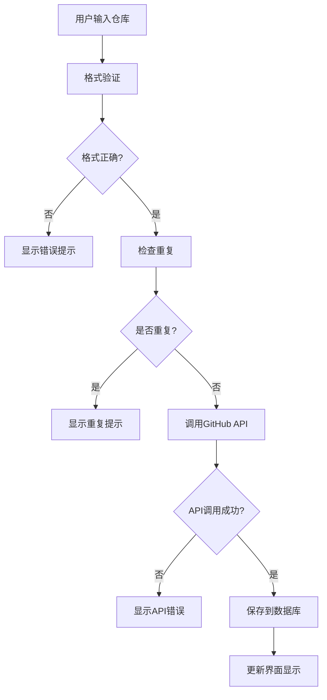
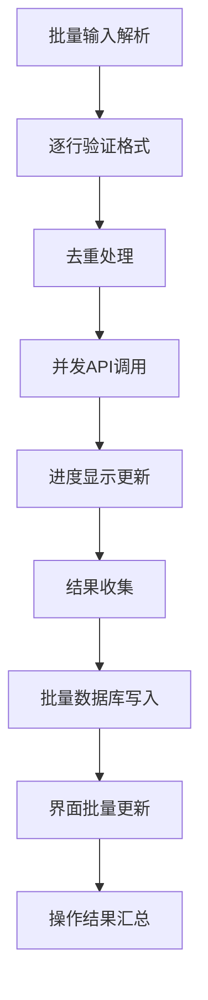
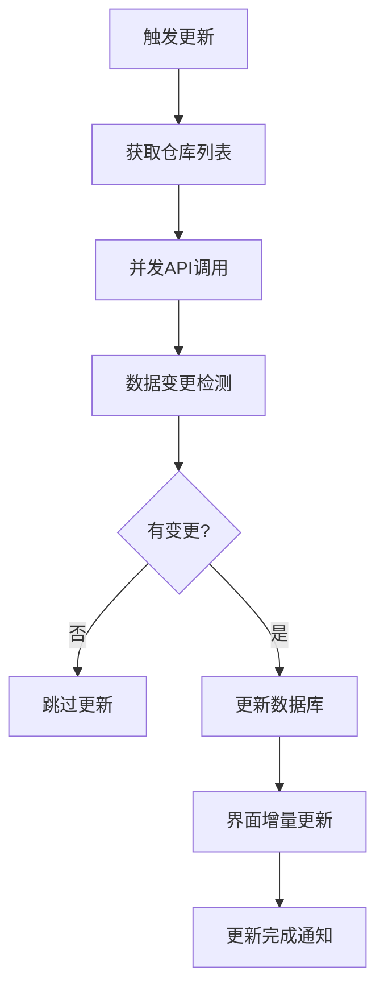

# GitHub仓库监控器 - 系统设计方案

## 🎯 设计理念

### 核心原则
- **简洁至上**: 极简的架构设计，专注核心功能
- **性能优先**: 高性能的用户体验，快速响应
- **稳定可靠**: 零依赖设计，长期稳定运行
- **用户友好**: 直观的界面和流畅的交互体验

### 设计目标
- 提供高效的GitHub仓库监控解决方案
- 实现企业级的稳定性和可靠性
- 保持极简的架构和最少的维护成本
- 支持大数据量的流畅处理和显示

## 🏗️ 系统架构

### 整体架构图
```
┌─────────────────────────────────────────────────────────┐
│                    GazerHub                             │
├─────────────────────────────────────────────────────────┤
│  前端界面层 (Frontend)                                   │
│  ┌─────────────┐ ┌─────────────┐ ┌─────────────┐        │
│  │  index.html │ │ MainApp.js  │ │  main.css   │        │
│  │   主页面    │ │  核心逻辑   │ │   样式文件  │        │
│  └─────────────┘ └─────────────┘ └─────────────┘        │
├─────────────────────────────────────────────────────────┤
│  后端服务层 (Backend)                                    │
│  ┌─────────────┐ ┌─────────────┐ ┌─────────────┐        │
│  │   main.go   │ │ handlers.go │ │  logger.go  │        │
│  │   应用入口  │ │  API处理    │ │   日志系统  │        │
│  └─────────────┘ └─────────────┘ └─────────────┘        │
├─────────────────────────────────────────────────────────┤
│  数据存储层 (Database)                                   │
│  ┌─────────────┐ ┌─────────────┐ ┌─────────────┐        │
│  │  gorm.db    │ │   go.mod    │ │    logs/    │        │
│  │ SQLite数据库│ │  Go模块依赖 │ │  日志文件   │        │
│  └─────────────┘ └─────────────┘ └─────────────┘        │
├─────────────────────────────────────────────────────────┤
│  外部服务层 (External)                                   │
│  ┌─────────────────────────────────────────────────────┐ │
│  │               GitHub API v63                        │ │
│  │          仓库信息获取和状态监控                      │ │
│  └─────────────────────────────────────────────────────┘ │
└─────────────────────────────────────────────────────────┘
```

### 层次划分
1. **前端界面层**: 用户交互和数据展示
2. **后端服务层**: 业务逻辑和API处理
3. **数据存储层**: 数据持久化和配置管理
4. **外部服务层**: GitHub API集成

## 🔧 技术架构

### 后端架构设计
```go
// 核心组件结构
main.go           // 应用程序入口
├── 服务初始化
├── 路由配置
├── 中间件设置
└── 优雅关闭

internal/api/handlers.go  // API处理逻辑 (1900+行)
├── 仓库管理接口
├── 状态查询接口
├── 配置管理接口
├── 后台任务处理
├── GitHub API集成
└── 健康检查接口

internal/logger/logger.go // 日志系统
├── 日志配置
├── 文件输出
├── 格式设置
└── 级别控制
```

### 前端架构设计
```javascript
// 组件结构
index.html        // 页面结构
├── 基础HTML结构
├── Meta信息配置
├── Vue.js 3引入
├── 样式引入
└── 脚本加载

src/app.js        // 应用启动入口
├── Vue应用创建
├── 全局错误处理
├── 应用挂载
└── 启动日志

src/main.js       // 主应用组件
├── 应用状态管理
├── API通信模块
├── 用户界面控制
├── 事件处理系统
└── 工具函数库

src/styles/main.css // 样式系统
├── 基础样式定义
├── 组件样式规则
├── 响应式断点
└── 动画效果
```

## 📋 技术栈更新 (2025-08-28)

### 后端技术栈
- **Go 1.25+**: 高性能后端服务，支持最新语言特性
- **Gin Framework**: 轻量级Web框架，高性能路由
- **GORM**: 现代化ORM框架，简化数据库操作
- **SQLite**: 嵌入式数据库，零配置部署
- **GitHub API v63**: 官方GitHub API客户端，最新版本
- **OAuth2**: GitHub认证支持，安全访问

### 前端技术栈
- **Vue.js 3**: 渐进式JavaScript框架，Composition API
- **原生CSS3**: Grid布局、Flexbox、响应式设计
- **HTML5**: 语义化标记，无障碍访问
- **零构建工具**: 直接部署，无需编译，长期稳定

### 系统特性
- **后台任务系统**: 异步仓库状态更新，定时任务调度
- **日志系统**: 结构化日志输出，多级别控制，文件轮转
- **数据库管理**: SQLite嵌入式数据库，GORM自动迁移
- **性能监控**: GitHub API速率限制监控，后台任务状态

## 📊 数据库设计

### 数据模型
```sql
-- 仓库信息表
repositories {
    id            INTEGER PRIMARY KEY
    name          TEXT UNIQUE         -- 仓库名称 (owner/repo)
    full_name     TEXT               -- 完整名称
    description   TEXT               -- 仓库描述
    stars_count   INTEGER            -- Star数量
    forks_count   INTEGER            -- Fork数量
    issues_count  INTEGER            -- Issue数量
    language      TEXT               -- 主要编程语言
    updated_at    DATETIME           -- 最后更新时间
    last_commit   TEXT               -- 最后提交信息
    status        TEXT               -- 状态 (active/error)
    error_message TEXT               -- 错误信息
    created_at    DATETIME           -- 创建时间
    updated_at    DATETIME           -- 修改时间
}

-- 配置信息表
configs {
    key           TEXT PRIMARY KEY   -- 配置键
    value         TEXT               -- 配置值
    description   TEXT               -- 配置描述
    created_at    DATETIME           -- 创建时间
    updated_at    DATETIME           -- 修改时间
}
```

### 索引设计
```sql
-- 性能优化索引
CREATE INDEX idx_repositories_name ON repositories(name);
CREATE INDEX idx_repositories_status ON repositories(status);
CREATE INDEX idx_repositories_updated_at ON repositories(updated_at);
CREATE INDEX idx_configs_key ON configs(key);
```

## 🎨 界面设计

### 设计语言
- **色彩系统**: 现代化的渐变色彩和柔和配色
- **字体系统**: 系统默认字体，确保最佳兼容性
- **间距系统**: 8px基础间距，构建和谐的视觉节奏
- **圆角系统**: 8px圆角，营造现代化的视觉效果

### 组件设计
```css
/* 设计标记系统 */
:root {
    /* 色彩变量 */
    --primary-color: #007bff;
    --success-color: #28a745;
    --warning-color: #ffc107;
    --danger-color: #dc3545;
    --light-color: #f8f9fa;
    --dark-color: #343a40;
    
    /* 间距变量 */
    --spacing-xs: 4px;
    --spacing-sm: 8px;
    --spacing-md: 16px;
    --spacing-lg: 24px;
    --spacing-xl: 32px;
    
    /* 圆角变量 */
    --border-radius-sm: 4px;
    --border-radius-md: 8px;
    --border-radius-lg: 12px;
    
    /* 阴影变量 */
    --shadow-sm: 0 1px 3px rgba(0,0,0,0.1);
    --shadow-md: 0 4px 6px rgba(0,0,0,0.1);
    --shadow-lg: 0 10px 15px rgba(0,0,0,0.1);
}
```

### 响应式断点
```css
/* 断点系统 */
/* 移动设备优先 */
@media (min-width: 768px) {  /* 平板及以上 */
    /* 中等屏幕样式 */
}

@media (min-width: 1200px) { /* 桌面及以上 */
    /* 大屏幕样式 */
}

@media (max-width: 767px) {  /* 小屏幕专用 */
    /* 移动端优化样式 */
}
```

## 🔄 业务流程设计

### 仓库添加流程


### 批量操作流程


### 数据更新流程


## ⚡ 性能设计

### 前端性能优化
- **分页渲染**: 大数据集的分页显示机制
- **虚拟滚动**: 只渲染可见区域的DOM元素
- **防抖搜索**: 减少频繁的搜索请求
- **增量更新**: 只更新变化的数据和DOM

### 后端性能优化
- **并发处理**: Go协程实现高并发API调用
- **连接池**: 数据库连接池优化数据库访问
- **缓存策略**: 智能缓存减少重复API调用
- **批量操作**: 数据库批量写入提升性能

### 网络性能优化
- **请求合并**: 合并多个API请求减少网络开销
- **压缩传输**: Gzip压缩减少传输数据量
- **CDN加速**: 静态资源CDN分发（如需要）
- **HTTP/2**: 利用HTTP/2的多路复用特性

## 🔒 安全设计

### 数据安全
- **本地存储**: 所有敏感数据存储在本地
- **输入验证**: 严格的用户输入验证和过滤
- **SQL注入防护**: 使用参数化查询防止SQL注入
- **XSS防护**: 前端输入输出的XSS过滤

### API安全
- **Token管理**: 安全的GitHub Token存储和使用
- **请求限制**: 合理的API请求频率控制
- **错误处理**: 不暴露敏感的错误信息
- **HTTPS**: 强制使用HTTPS进行API通信

### 系统安全
- **权限控制**: 最小权限原则的系统访问
- **日志安全**: 敏感信息不记录在日志中
- **配置安全**: 配置文件的安全存储和访问
- **更新安全**: 安全的软件更新机制

## 📈 监控设计

### 系统监控
- **性能指标**: CPU、内存、磁盘使用监控
- **应用指标**: 请求量、响应时间、错误率
- **业务指标**: 仓库数量、更新频率、用户活跃度
- **健康检查**: 定期的系统健康状态检查

### 错误监控
- **异常捕获**: 全面的异常捕获和记录
- **错误分类**: 按类型和严重程度分类错误
- **告警机制**: 关键错误的及时告警通知
- **恢复策略**: 自动和手动的错误恢复机制

### 日志设计
```go
// 日志级别设计
type LogLevel int

const (
    DEBUG LogLevel = iota  // 调试信息
    INFO                   // 一般信息
    WARN                   // 警告信息
    ERROR                  // 错误信息
    FATAL                  // 致命错误
)

// 日志格式设计
type LogEntry struct {
    Timestamp time.Time
    Level     LogLevel
    Message   string
    Module    string
    RequestID string
    UserID    string
    Extra     map[string]interface{}
}
```

## 🚀 部署设计

### 部署架构
```
┌─────────────────────────────────────────┐
│              部署环境                    │
├─────────────────────────────────────────┤
│  应用程序 (github-monitor)              │
│  ├── 二进制文件                         │
│  ├── 配置文件                          │
│  └── 静态资源                          │
├─────────────────────────────────────────┤
│  数据存储                               │
│  ├── SQLite数据库文件                   │
│  └── 日志文件目录                       │
├─────────────────────────────────────────┤
│  系统环境                               │
│  ├── Go运行时 (如果需要)                │
│  ├── 操作系统 (Linux/Windows/macOS)    │
│  └── 网络环境                          │
└─────────────────────────────────────────┘
```

### 部署流程
1. **环境准备**: 确保目标环境满足运行要求
2. **文件部署**: 复制应用程序和相关文件
3. **配置设置**: 配置GitHub Token和系统参数
4. **服务启动**: 启动应用程序服务
5. **健康检查**: 验证服务正常运行
6. **监控启用**: 启用系统监控和日志记录

### 配置管理
```json
{
  "server": {
    "port": 8080,
    "host": "localhost"
  },
  "database": {
    "path": "gorm.db",
    "max_connections": 10
  },
  "github": {
    "token": "可选的GitHub Token",
    "api_base_url": "https://api.github.com"
  },
  "logging": {
    "level": "info",
    "file": "logs/app.log",
    "max_size": "100MB"
  }
}
```

## 🔄 扩展设计

### 功能扩展点
- **插件系统**: 支持自定义功能插件
- **主题系统**: 可自定义的界面主题
- **通知系统**: 多种方式的通知推送
- **导出功能**: 多格式的数据导出

### 技术扩展点
- **数据库扩展**: 支持PostgreSQL、MySQL等
- **缓存扩展**: 支持Redis等外部缓存
- **消息队列**: 支持异步任务处理
- **微服务**: 拆分为多个微服务

### 集成扩展点
- **CI/CD集成**: 与构建流水线集成
- **监控集成**: 与Prometheus、Grafana集成
- **认证集成**: 与LDAP、OAuth2集成
- **API扩展**: 提供更丰富的API接口

---

*设计方案为项目提供了清晰的技术路线和实现指导*
